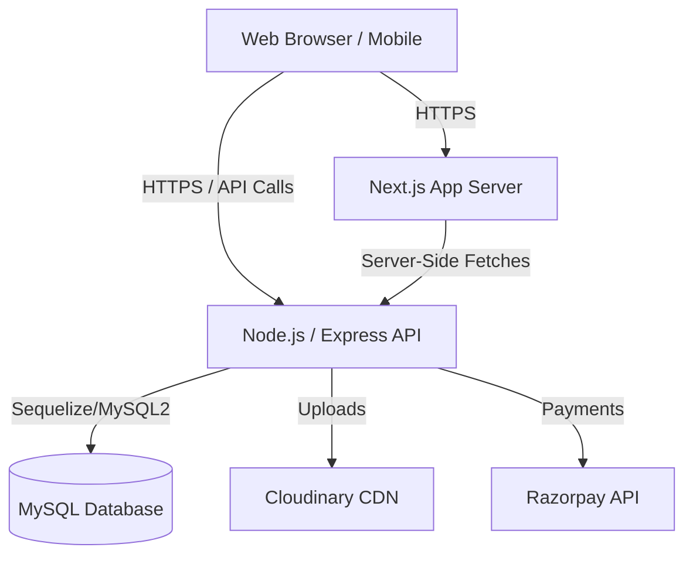
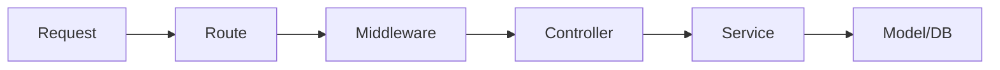
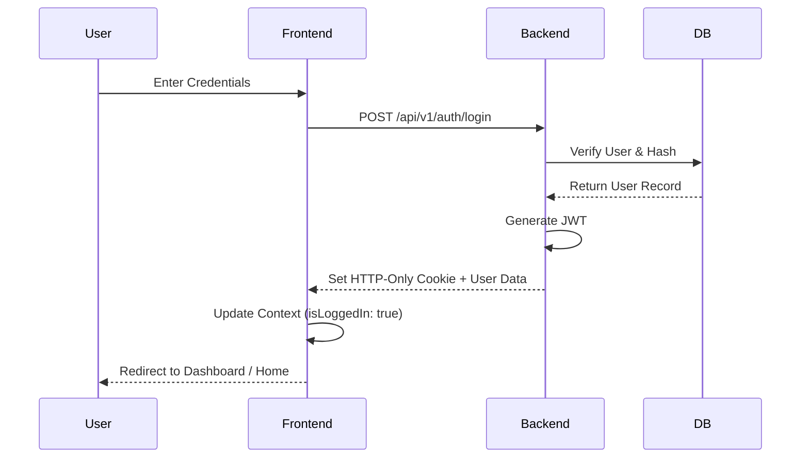
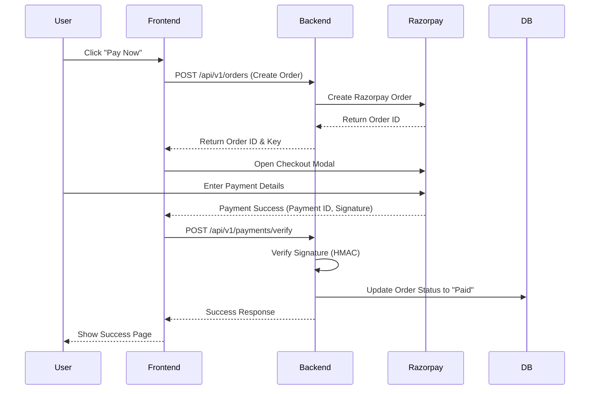
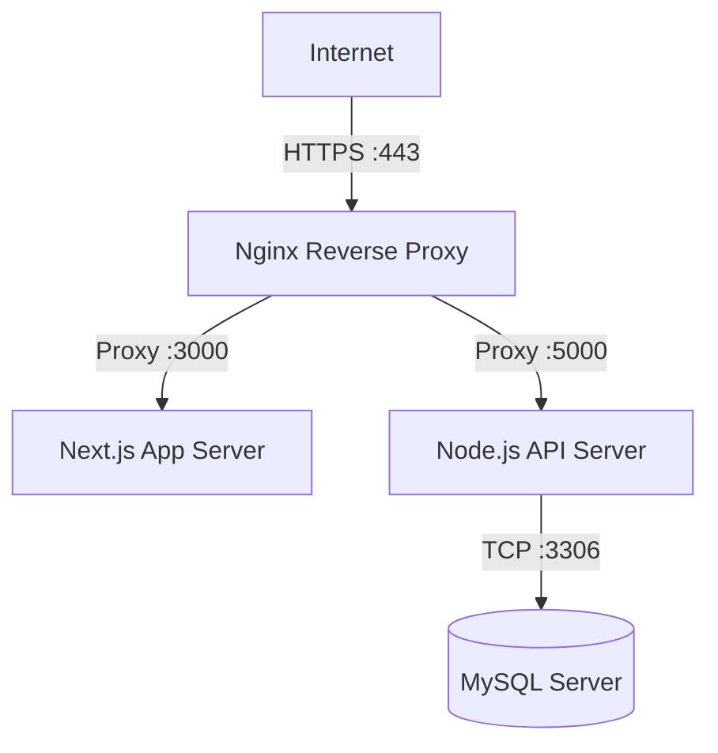

# System Architecture

## 1. Overall System Architecture
Weebster follows a modern, decoupled client-server architecture. The frontend is built with Next.js (App Router), leveraging both server and client components for optimal SEO and performance. The backend is a monolithic Node.js/Express REST API that handles business logic and interfaces with a MySQL database.



## 2. Frontend Architecture
**Framework:** Next.js (App Router)
**Styling:** CSS Modules + Global CSS (No Tailwind)
**State Management:** React Context API for global state (Cart, User Auth, Theme) and local state (`useState`, `useReducer`) for component-level data.
**Data Fetching:** Server Components for initial payload and SEO (Products, Categories). Client-side fetching (SWR or React Query) for dynamic data (Cart, User Profile).

**Key Paradigms:**
- **Mobile-First:** Styles are written for mobile first, progressively enhanced for larger screens using media queries.
- **Component Driven:** Highly reusable component library (Buttons, Cards, Inputs).
- **Optimistic UI:** Used for actions like "Add to Wishlist" to make the application feel instantly responsive.

## 3. Backend Architecture
**Framework:** Node.js with Express.js
**Architecture Pattern:** Layered Architecture (Controller-Service-Repository)

- **Routes Layer:** Defines API endpoints and attaches middleware (Auth, Validation).
- **Controller Layer:** Extracts HTTP requests, calls the service layer, and formats HTTP responses.
- **Service Layer:** Contains core business logic (e.g., applying discounts, checking inventory).
- **Repository/Data Layer:** Handles direct interactions with the MySQL database.



## 4. Database Layer
**Engine:** MySQL
**Connection:** Managed via connection pooling to handle high concurrent traffic.
**ORM/Query Builder:** Knex.js or Sequelize (or raw MySQL2 with prepared statements for maximum performance).
The database is strictly normalized (3NF) to ensure data integrity, especially crucial for a scalable e-commerce catalog with variants and complex pricing rules.

## 5. Authentication Flow
Authentication uses stateless JWT (JSON Web Tokens).


*Note: Tokens are stored in HTTP-Only, Secure cookies to prevent XSS attacks.*

## 6. Payment Flow (Razorpay)



## 7. Cloudinary Flow
Used for scalable image storage and optimization.
1. Admin uploads an image from the Dashboard.
2. The Node.js server receives the multipart form data.
3. Server streams the file directly to Cloudinary using their secure SDK.
4. Cloudinary returns a secure URL.
5. The URL is saved in the MySQL database (e.g., `product_images` table).

## 8. Deployment Architecture
**Hosting:** Hostinger VPS
**OS:** Ubuntu Server
**Process Manager:** PM2 (for Node.js and Next.js processes)
**Reverse Proxy:** Nginx (Handles SSL termination, routes traffic to PM2 ports)



## 9. Folder Structure

### Monorepo Structure
```text
weebster/
├── frontend/                 # Next.js App
│   ├── src/
│   │   ├── app/              # App Router (Pages & Layouts)
│   │   ├── components/       # Reusable UI Components
│   │   ├── styles/           # Global CSS, Variables
│   │   ├── hooks/            # Custom React Hooks
│   │   ├── context/          # React Contexts
│   │   ├── utils/            # Helper functions
│   │   └── types/            # TypeScript definitions (if used)
│   ├── public/               # Static assets (fonts, icons)
│   └── next.config.js
│
├── backend/                  # Node.js API
│   ├── src/
│   │   ├── api/
│   │   │   ├── routes/       # Express routes
│   │   │   ├── controllers/  # Request handlers
│   │   │   └── middlewares/  # Auth, validation, error handling
│   │   ├── services/         # Business logic
│   │   ├── models/           # DB schema definitions
│   │   ├── config/           # Environment and DB config
│   │   └── utils/            # Helpers (JWT, Cloudinary, Razorpay)
│   ├── server.js             # Entry point
│   └── package.json
```
