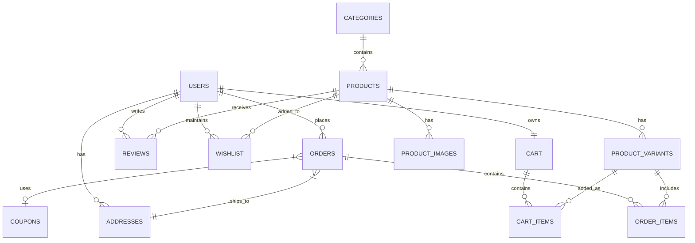

# Database Schema

## 1. Overview
The database uses MySQL, designed in 3rd Normal Form (3NF) to ensure data integrity and prevent redundancy. The schema is highly scalable, supporting the initial 50 products and easily scaling to 1000+ products with complex variant structures.

## 2. Entity Relationship (ER) Diagram

## 3. Tables & Columns

### 3.1. `users`
Stores customer and admin credentials.
- `id` (INT, PK, Auto Increment)
- `first_name` (VARCHAR)
- `last_name` (VARCHAR)
- `email` (VARCHAR, Unique, Indexed)
- `password_hash` (VARCHAR)
- `role` (ENUM: 'customer', 'admin') - Default: 'customer'
- `phone` (VARCHAR)
- `created_at` (TIMESTAMP)
- `updated_at` (TIMESTAMP)

### 3.2. `addresses`
Stores multiple addresses for users.
- `id` (INT, PK)
- `user_id` (INT, FK -> users.id)
- `type` (ENUM: 'home', 'work', 'other')
- `street_address` (VARCHAR)
- `city` (VARCHAR)
- `state` (VARCHAR)
- `pincode` (VARCHAR)
- `is_default` (BOOLEAN)

### 3.3. `categories`
Hierarchical product categories.
- `id` (INT, PK)
- `name` (VARCHAR)
- `slug` (VARCHAR, Unique)
- `parent_id` (INT, FK -> categories.id, Nullable)
- `image_url` (VARCHAR)
- `is_active` (BOOLEAN)

### 3.4. `products`
Core product details.
- `id` (INT, PK)
- `category_id` (INT, FK -> categories.id)
- `name` (VARCHAR)
- `slug` (VARCHAR, Unique, Indexed)
- `description` (TEXT)
- `specifications` (JSON) - Extensible spec storage
- `base_price` (DECIMAL 10,2)
- `is_featured` (BOOLEAN)
- `status` (ENUM: 'draft', 'published', 'archived')
- `created_at` (TIMESTAMP)

### 3.5. `product_variants`
Handles SKUs, distinct stock, and price overrides for variants (e.g., color, size).
- `id` (INT, PK)
- `product_id` (INT, FK -> products.id)
- `sku` (VARCHAR, Unique, Indexed)
- `variant_name` (VARCHAR) - e.g., "Red", "Large"
- `price_override` (DECIMAL 10,2, Nullable)
- `discount_price` (DECIMAL 10,2, Nullable)
- `stock_quantity` (INT)
- `weight_grams` (INT) - For shipping calculations

### 3.6. `product_images`
Multiple images per product/variant.
- `id` (INT, PK)
- `product_id` (INT, FK -> products.id)
- `variant_id` (INT, FK -> product_variants.id, Nullable)
- `image_url` (VARCHAR)
- `alt_text` (VARCHAR)
- `sort_order` (INT)

### 3.7. `orders`
Master order record.
- `id` (INT, PK)
- `user_id` (INT, FK -> users.id)
- `address_id` (INT, FK -> addresses.id)
- `coupon_id` (INT, FK -> coupons.id, Nullable)
- `order_number` (VARCHAR, Unique)
- `subtotal` (DECIMAL 10,2)
- `discount_amount` (DECIMAL 10,2)
- `shipping_fee` (DECIMAL 10,2)
- `total_amount` (DECIMAL 10,2)
- `payment_method` (ENUM: 'razorpay', 'cod')
- `payment_status` (ENUM: 'pending', 'paid', 'failed', 'refunded')
- `order_status` (ENUM: 'pending', 'processing', 'shipped', 'delivered', 'cancelled')
- `razorpay_order_id` (VARCHAR)
- `created_at` (TIMESTAMP)

### 3.8. `order_items`
Line items for an order.
- `id` (INT, PK)
- `order_id` (INT, FK -> orders.id)
- `product_variant_id` (INT, FK -> product_variants.id)
- `quantity` (INT)
- `unit_price` (DECIMAL 10,2)
- `total_price` (DECIMAL 10,2)

### 3.9. `coupons`
Discount codes.
- `id` (INT, PK)
- `code` (VARCHAR, Unique)
- `type` (ENUM: 'percentage', 'flat')
- `value` (DECIMAL 10,2)
- `min_cart_value` (DECIMAL 10,2)
- `start_date` (DATETIME)
- `end_date` (DATETIME)
- `usage_limit` (INT)
- `times_used` (INT)
- `is_active` (BOOLEAN)

### 3.10. `reviews`
User product reviews.
- `id` (INT, PK)
- `product_id` (INT, FK -> products.id)
- `user_id` (INT, FK -> users.id)
- `rating` (INT 1-5)
- `comment` (TEXT)
- `is_approved` (BOOLEAN) - Moderated by admin
- `created_at` (TIMESTAMP)

### 3.11. `banners`
For homepage carousel and marketing.
- `id` (INT, PK)
- `title` (VARCHAR)
- `image_url` (VARCHAR)
- `link_url` (VARCHAR)
- `position` (ENUM: 'hero', 'mid-section')
- `is_active` (BOOLEAN)
- `sort_order` (INT)

## 4. Indexes & Performance
- **Primary Keys:** Clustered indexes on all `id` columns.
- **Foreign Keys:** Indexed to speed up JOINs (e.g., `product_id` in `product_variants`).
- **Unique Indexes:** `email`, `slug` in `products`, `sku` in `product_variants`.
- **Search Optimization:** Index on `products.name` and `products.status`.

## 5. Future Scalability Considerations
- **NoSQL Offloading:** Product reviews and specifications (currently JSON) can be migrated to MongoDB if schemas become excessively complex.
- **Caching:** Frequently accessed data like Categories and Active Banners should be cached using Redis.
- **Partitioning:** As `orders` and `order_items` tables grow into the millions, table partitioning based on `created_at` date ranges can be implemented.
