# Entity-Relationship (ER) Diagram - Weebster

This document provides the visual mapping of the Weebster database schema using Mermaid ER syntax.

---

## 1. Complete Schema ER Diagram

```mermaid
erDiagram
    %% Identity & Access Management
    users {
        int id PK
        string email
        string password_hash
        string first_name
        string last_name
        string phone
        string role "ENUM(CUSTOMER, ADMIN)"
        boolean is_verified
        datetime created_at
        datetime updated_at
        datetime deleted_at
    }

    addresses {
        int id PK
        int user_id FK
        string label "Home/Work"
        string street
        string city
        string state
        string pincode
        boolean is_default
    }

    %% Catalog & Product Management
    categories {
        int id PK
        int parent_id FK "Nullable"
        string name
        string slug
        string description
        string image_url
        boolean is_active
    }

    products {
        int id PK
        int category_id FK
        string name
        string slug
        string description
        string base_price
        string compare_price
        boolean is_active
        float average_rating
        int total_reviews
        datetime created_at
        datetime updated_at
        datetime deleted_at
    }

    product_images {
        int id PK
        int product_id FK
        string image_url
        string alt_text
        int display_order
        boolean is_primary
    }

    variants {
        int id PK
        int product_id FK
        string sku
        string name "e.g., Red / Small"
        decimal price_override
        boolean is_active
    }

    inventory {
        int id PK
        int variant_id FK
        int warehouse_id "Default 1"
        int quantity_available
        int quantity_reserved
    }

    %% Commerce Engine (Orders & Payments)
    orders {
        int id PK
        string order_number "UUID/CUID"
        int user_id FK "Nullable for Guests"
        string status "ENUM(PENDING, PROCESSING, SHIPPED, DELIVERED, CANCELLED)"
        decimal subtotal
        decimal shipping_fee
        decimal discount_total
        decimal grand_total
        string shipping_address_snapshot "JSON"
        string contact_email
        string contact_phone
        datetime created_at
        datetime updated_at
    }

    order_items {
        int id PK
        int order_id FK
        int variant_id FK "Nullable if product deleted"
        string product_name_snapshot
        string sku_snapshot
        decimal price_at_purchase
        int quantity
        decimal total_price
    }

    payments {
        int id PK
        int order_id FK
        string provider "ENUM(RAZORPAY, COD)"
        string provider_order_id "Razorpay Order ID"
        string provider_payment_id "Razorpay Payment ID"
        string status "ENUM(PENDING, SUCCESS, FAILED, REFUNDED)"
        decimal amount
        datetime created_at
    }

    %% Marketing & Engagement
    wishlists {
        int id PK
        int user_id FK
        int product_id FK
        datetime created_at
    }

    reviews {
        int id PK
        int product_id FK
        int user_id FK
        int rating "1-5"
        string comment
        boolean is_approved
        datetime created_at
    }

    %% Relationships
    users ||--o{ addresses : "has"
    users ||--o{ orders : "places"
    users ||--o{ wishlists : "saves"
    users ||--o{ reviews : "writes"

    categories ||--o{ categories : "parent_to_child"
    categories ||--o{ products : "contains"

    products ||--o{ product_images : "has_images"
    products ||--|{ variants : "has_variants"
    products ||--o{ reviews : "receives"
    products ||--o{ wishlists : "saved_in"

    variants ||--|| inventory : "tracked_by"
    variants ||--o{ order_items : "purchased_as"

    orders ||--|{ order_items : "contains"
    orders ||--|| payments : "paid_via"
```

## 2. Architectural Notes on the Diagram
- **Guests vs Users:** The `user_id` on the `orders` table is nullable. This allows Guest Checkout without forcing account creation.
- **Snapshot Integrity:** `order_items` stores copies of `product_name_snapshot` and `price_at_purchase`. This ensures the order receipt is immutable, even if the underlying product name or price changes in the `products` table later.
- **Inventory Isolation:** Inventory is separated from the `variants` table into an `inventory` table. This allows us to track stock across multiple physical stores in the future by simply adding rows with different `warehouse_id`s, rather than altering the core product schema.
