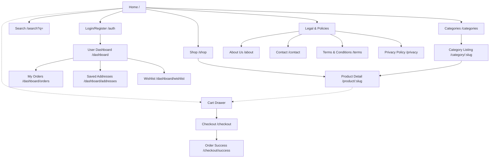
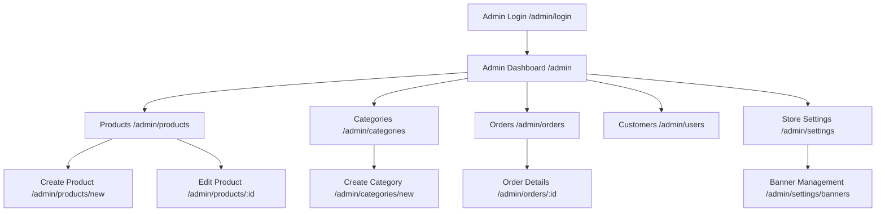

# Sitemap - Weebster

This document maps the complete page hierarchy for the Weebster platform. It acts as the master visual index for all accessible routes.

---

## 1. Customer Website (Public & Protected)

## 2. Admin Dashboard (Protected)

## 3. Dynamic Pages Strategy
Pages generated dynamically based on database content:
- `/product/:slug`: Next.js `generateStaticParams` / ISR for product pages to ensure fast load times and SEO indexing.
- `/category/:slug`: Category listing pages.
- `/search`: Purely dynamic (Server-Side Rendered or Client-Side fetched) based on query parameters.

## 4. Future Expansion Pages
*These are mapped out to ensure the current IA does not block future roadmap items.*
- `/blog`: Content marketing hub.
- `/brands/:brand_slug`: Specific landing pages for partner brands (e.g., Lego, Hot Wheels).
- `/dashboard/wallet`: Future loyalty and rewards tracking.
- `/admin/inventory`: Advanced warehouse-level stock management.
