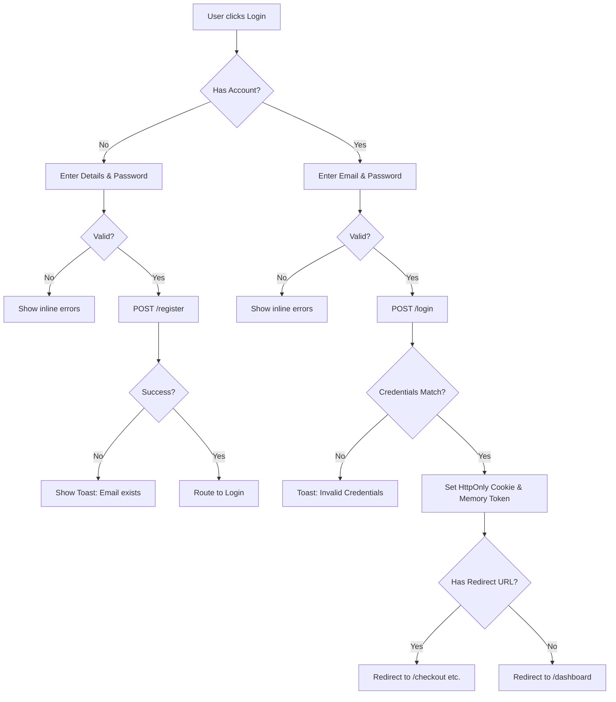
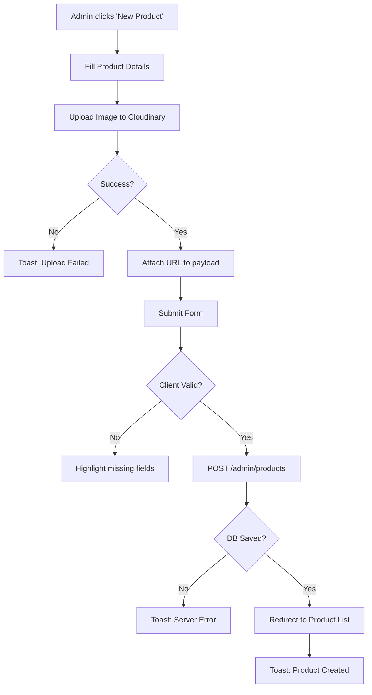
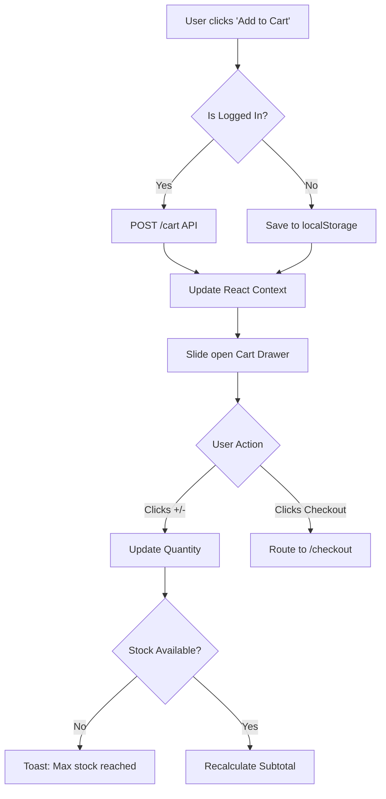
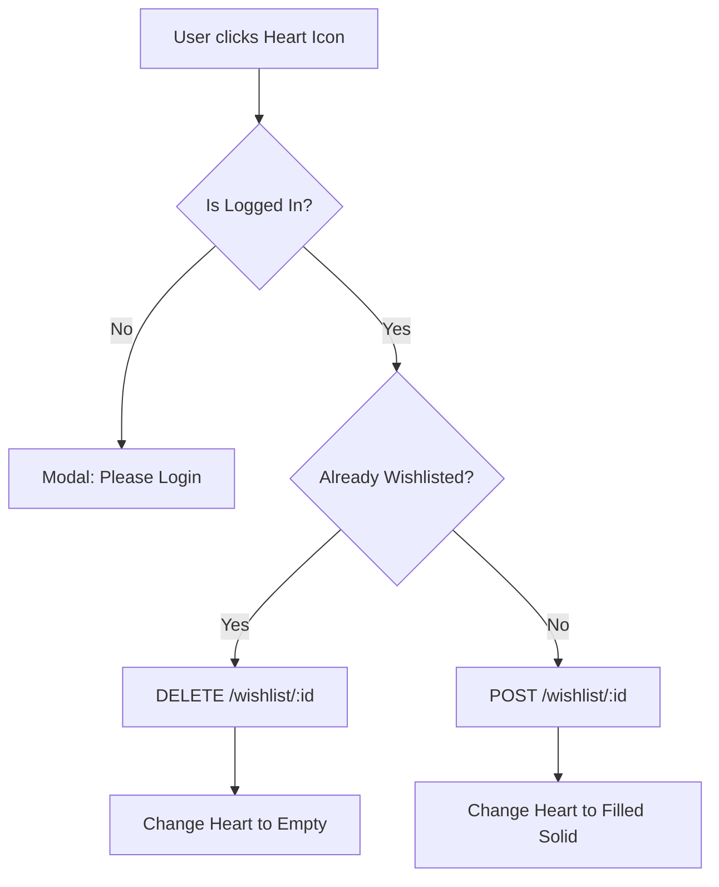

# User Flows - Weebster

This document maps out the specific, step-by-step logic gates a user encounters during critical application processes.

---

## 1. Authentication Flow (Login / Register)

## 2. Admin Product Creation Flow

## 3. Cart Interaction Flow

## 4. Wishlist Flow

