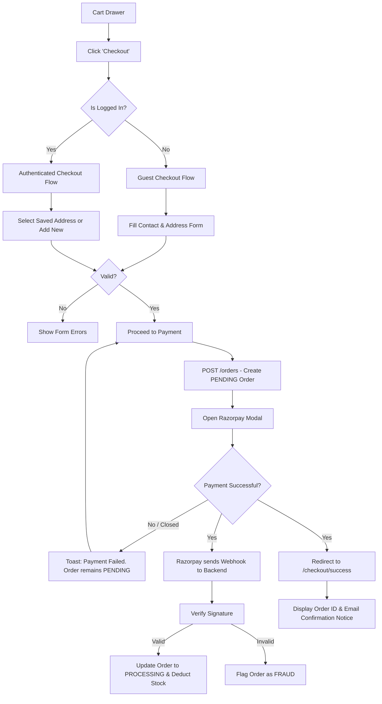

# Checkout Flow - Weebster

The Checkout flow is the most sensitive conversion funnel. It is deliberately isolated from the main site navigation to prevent abandonment.

---

## 1. Complete Checkout Process

## 2. Checkout IA Components

### Contact & Shipping Module
- **Guest View:** Standard form (Email, Phone, First Name, Last Name, Address 1, Address 2, City, State, Pincode).
- **Logged-In View:** Displays existing addresses as selectable cards. Provides an "Add New Address" button which opens a modal.

### Order Summary Module (Sticky Right Column)
- Constantly visible on Desktop. Folded into an accordion on Mobile (default collapsed to save space).
- Displays: Line items, Subtotal, Shipping Cost (e.g., Free over ₹999), and Final Total.

### Payment Module
- Exclusively handled by Razorpay.
- In V1, we do not implement custom forms for credit cards to ensure absolute PCI compliance. Razorpay's drop-in UI handles all payment methods (UPI, Cards, Netbanking).

## 3. Failure & Retry Paths
- **Browser Closure:** If a user closes the tab while the Razorpay modal is open, the Order exists in the database as `PENDING`. When the user returns to their Cart, the system should allow them to resume that order rather than creating a duplicate.
- **Stock Depletion During Checkout:** If a user sits on the checkout page for 3 hours, and the last item is bought by someone else, the `POST /orders` API must reject the request with a "Stock no longer available" error before opening Razorpay.

## 4. Future Expansion Nodes
- **Coupons:** A slot in the Order Summary module will be reserved for a "Promo Code" input in V2.
- **COD (Cash on Delivery):** Will require a pincode serviceability check API before displaying the COD payment option.
