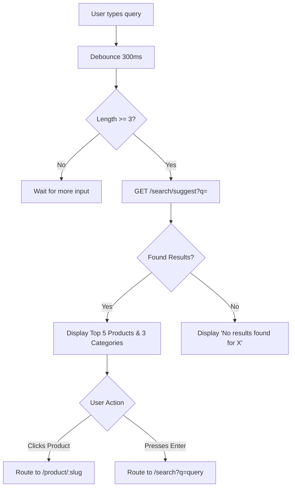

# Search Architecture - Weebster

Search is a primary navigation modality. With a scalable catalog, users must be able to find products via text queries efficiently.

---

## 1. Global Search Modality

### Desktop Trigger
- A prominent search input field in the top header.
- **State 1 (Inactive):** Displays placeholder *"Search for toys, brands, categories..."*
- **State 2 (Active/Focus):** Expands slightly in width. A dropdown panel opens immediately displaying "Popular Searches" (e.g., Action Figures, Hot Wheels).

### Mobile Trigger
- A magnifying glass icon in the Bottom Navigation Bar.
- **State:** Tapping opens a full-screen overlay. The keyboard is automatically focused.

## 2. Search Execution Flow

## 3. The Search Results Page (`/search?q=...`)
When a user presses "Enter" or clicks "View all results", they are taken to a dedicated search page.

### Layout
- **Header:** "Showing results for: 'Action Figures'" (with item count).
- **Body:** Standard Product Grid (mirrors the `/shop` page).
- **Sidebar:** Standard Filter architecture, but restricted only to facets applicable to the search results (e.g., if search yields no Lego, the Brand: Lego filter is hidden).

### Empty States (No Results)
- **Never Dead End:** If a query yields 0 results, the IA must provide an escape hatch.
- **Visuals:** "We couldn't find anything matching 'asdfgh'."
- **Fallback Content:** Render a grid of "Trending Right Now" or "New Arrivals" below the error message to keep the user engaged.

## 4. Typo Handling & Backend Logic (V1 vs V2)
- **Version 1 (Current):** Search relies on MySQL `LIKE '%query%'` across `title`, `description`, and `sku` columns. This requires exact substring matches.
- **Version 2 (Future Scalability):** The backend architecture must be decoupled enough to easily swap the MySQL search repository with Elasticsearch or Algolia. This will introduce typo-tolerance (fuzzy matching) and weighted results (title matches rank higher than description matches).

## 5. Recent & Popular Searches
- **Recent Searches:** Stored in the browser's `localStorage` (max 5 items). Displayed when the search input is focused but empty.
- **Popular Searches:** Stored in the database/cache, curated by admins or analytics. Displayed globally.
