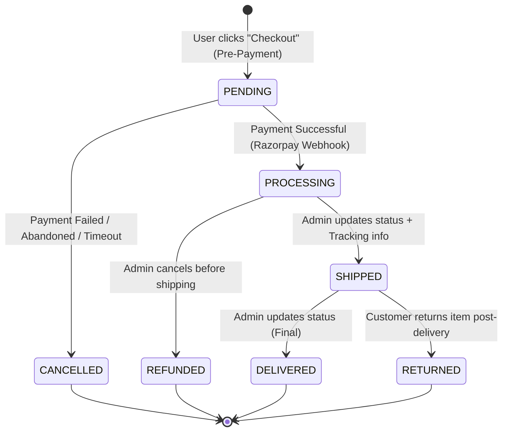
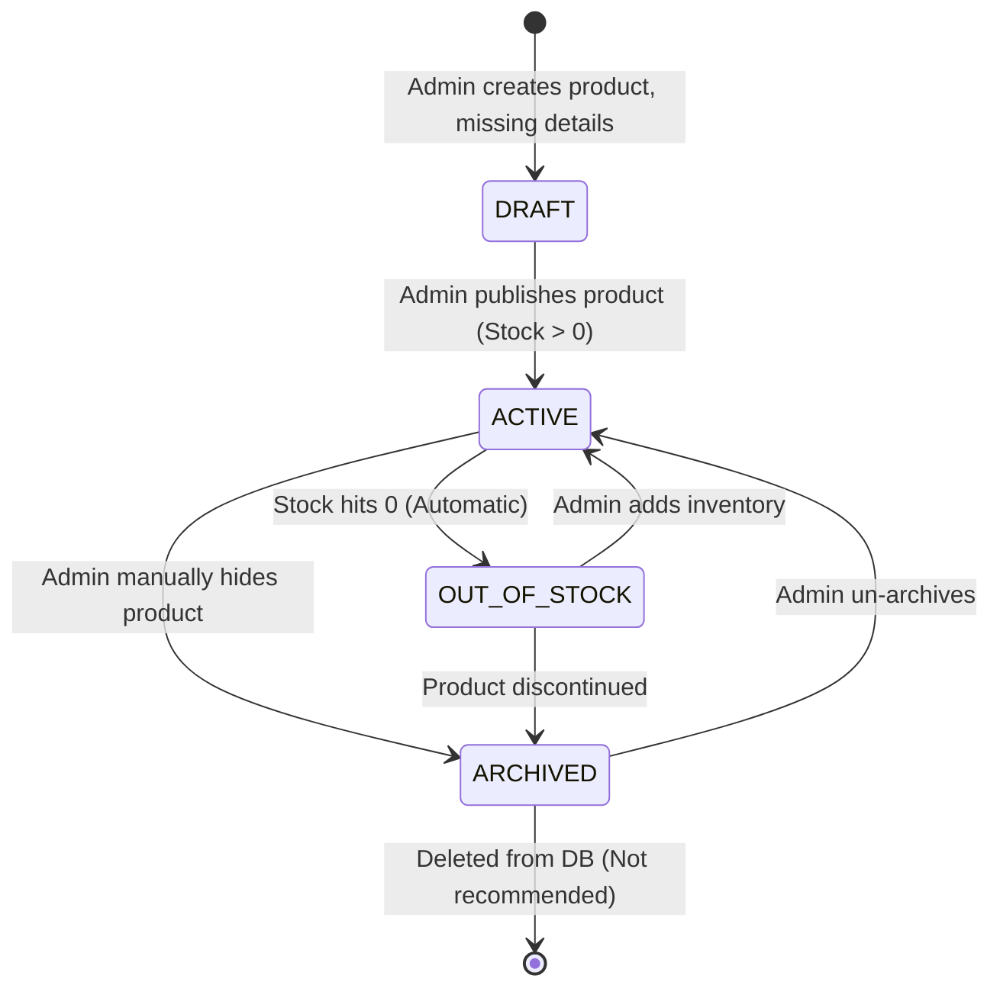
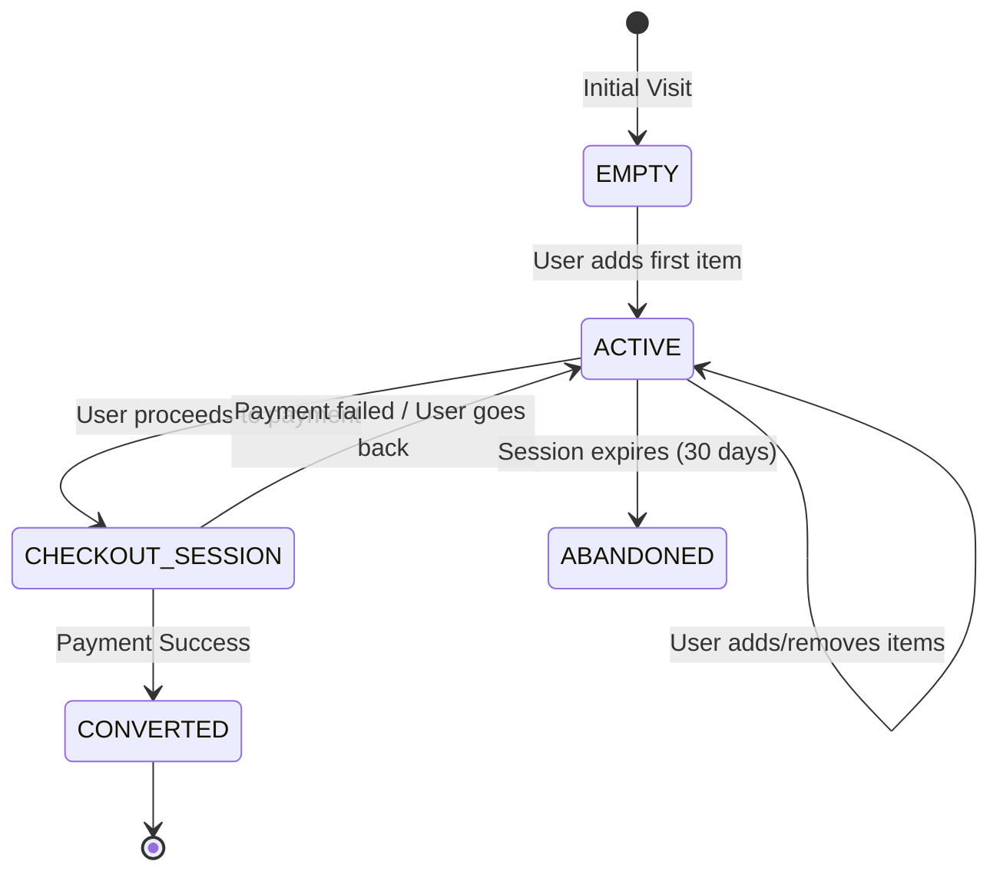

# State Diagrams - Weebster

This document illustrates the lifecycle of core entities within the platform to ensure the IA properly accounts for all possible edge cases.

---

## 1. Order Lifecycle State Diagram

The Order is the most complex state machine in the system.

*Architecture Rule:* Customers can only cancel an order while it is in the `PENDING` or `PROCESSING` state. Once `SHIPPED`, they must initiate a Return flow.

## 2. Product Lifecycle State Diagram

How a product moves from creation to the storefront.

*Architecture Rule:* Never hard-delete products if they have associated orders, as it will break historical order receipts. Use the `ARCHIVED` state to hide them from the public storefront while retaining database integrity.

## 3. Cart Lifecycle State Diagram

*Architecture Rule:* The cart data must gracefully transition from `localStorage` to the database when a Guest user registers or logs in, merging the anonymous cart with their authenticated cart.
